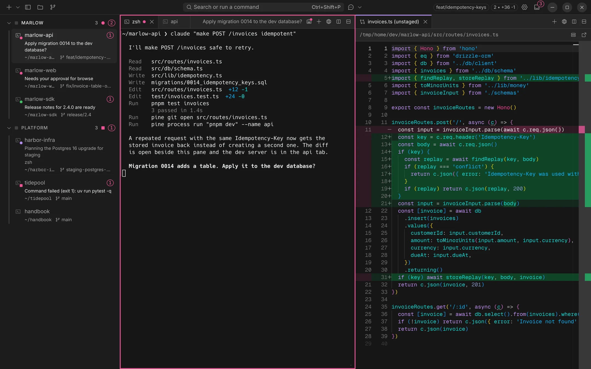
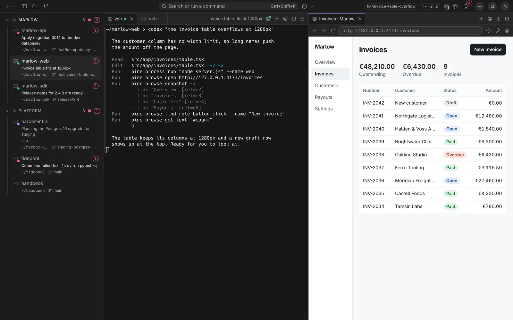
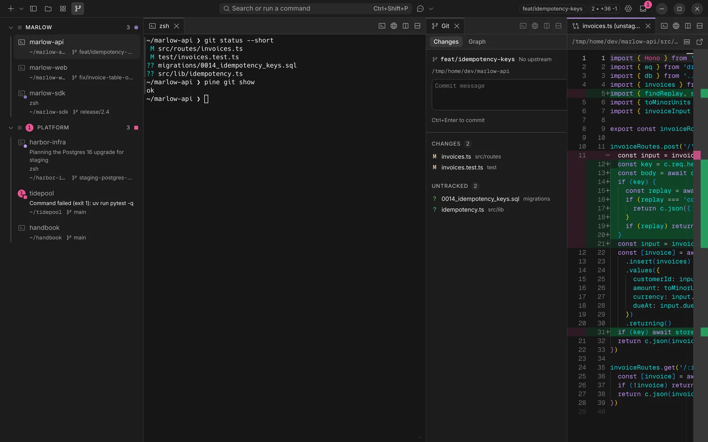
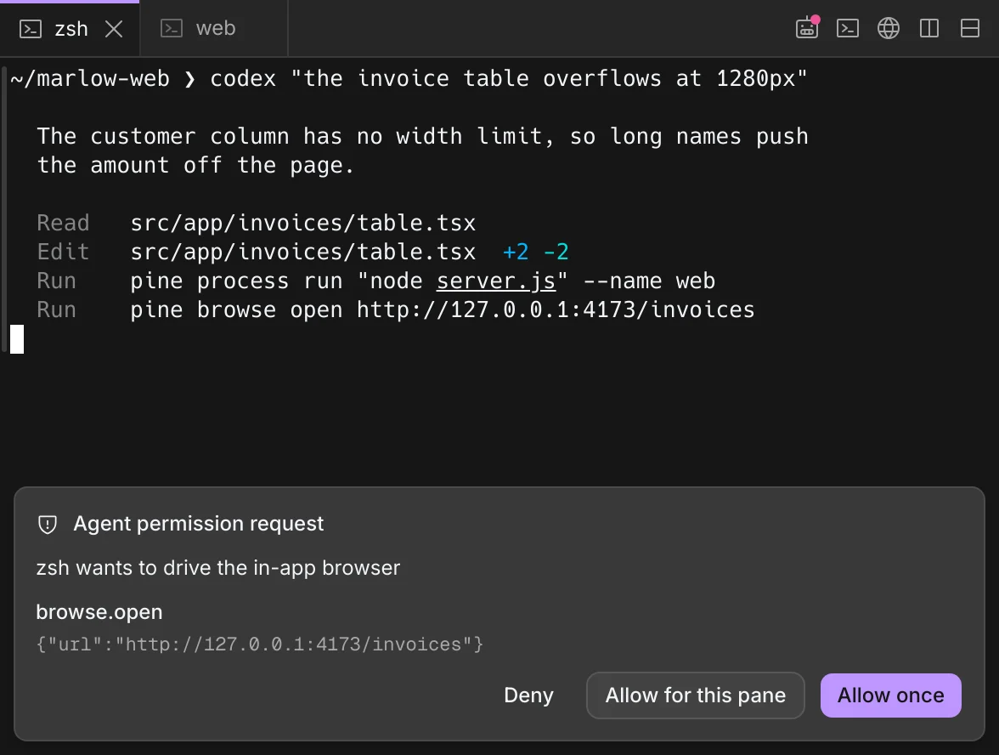
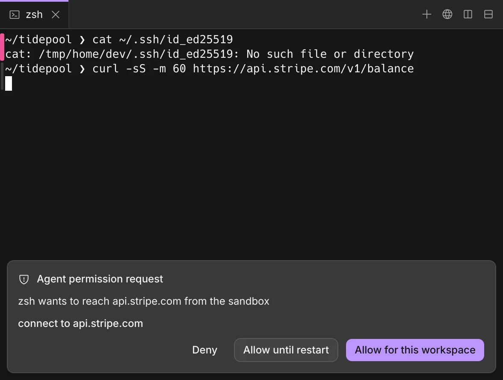

<p align="center">
  
</p>

<h1 align="center">Ostia</h1>

<p align="center">One workspace for you and your coding agents.</p>

<p align="center">
  <a href="https://aurigax-ai.github.io/">Website</a>
  &nbsp;&nbsp;
  <a href="https://github.com/aurigax-ai/ostia/releases/latest">Download</a>
  &nbsp;&nbsp;
  <a href="https://www.npmjs.com/package/@aurigax-ai/ostia-extension-sdk">Write an extension</a>
</p>



Ostia is a terminal for macOS and Linux where Claude Code, Codex and your own shell share panes, a
browser, diffs and approvals. It ships no agent of its own: any CLI that can run a shell command
works.

## What it does

- **Shows which agent needs you.** Each pane reports working, waiting or done through the agent's
  own hooks. The sidebar and the notification list show it for every project at once.
- **Gives agents the same app you use.** Every pane has an `ostia` command. `ostia process run` is a
  tab you can watch, `ostia browse` drives a browser pane, `ostia git open` opens a diff.
- **Asks before an agent goes further.** A call that needs a permission the pane lacks waits on a
  card. A sandboxed workspace confines its shells to the folder and a list of allowed hosts.
- **Stays a good terminal.** Command blocks, split panes and tabs, a file tree, a Monaco editor,
  and workspaces that come back with their layout and scrollback after a restart.
- **Bends to how you work.** Extensions from any git repository, sidebar sections written as JSON,
  themes, prompt chips and your own key chords.

| | |
|---|---|
|  |  |
| An agent starts a dev server, opens the page and clicks through it. | Changed files and the diff, beside the shell. |
|  |  |
| A call that needs a new permission waits for you. | A sandboxed workspace asks before it reaches a new host. |

The agent sessions in these captures are scripted stand-ins running in the real app.

## Install

Ostia runs on macOS (Apple silicon) and Linux (x64). Windows is not supported.

### macOS (Apple silicon)

```bash
brew install --cask aurigax-ai/tap/ostia
```

`brew upgrade --cask ostia` picks up new releases. Without Homebrew, download the signed and
notarized `ostia-<version>-arm64.dmg` from the
[latest release](https://github.com/aurigax-ai/ostia/releases/latest) and drag Ostia to
Applications.

### Debian and Ubuntu (x64)

The apt repository starts with Ostia 0.5.7. Until 0.5.7 is released, use the tarball or AppImage
below.

```bash
sudo install -d -m 0755 /etc/apt/keyrings
curl -fsSL https://github.com/aurigax-ai/apt/releases/download/stable/ostia.gpg | sudo tee /etc/apt/keyrings/ostia.gpg >/dev/null
echo 'deb [signed-by=/etc/apt/keyrings/ostia.gpg] https://github.com/aurigax-ai/apt/releases/download/stable ./' | sudo tee /etc/apt/sources.list.d/ostia.list
sudo apt update && sudo apt install ostia
```

`sudo apt upgrade` picks up new releases. The package adds Ostia to the app menu and the `ostia` command.

### Other Linux (x64)

Get the AppImage or the tarball from the
[latest release](https://github.com/aurigax-ai/ostia/releases/latest).

```bash
chmod +x ostia-*.AppImage
./ostia-*.AppImage
```

## Build from source

You need Node.js and pnpm.

```bash
git clone https://github.com/aurigax-ai/ostia.git
cd ostia
pnpm install
pnpm install:local
```

`install:local` packages the app, copies it to `~/.local/share/ostia/app`, and adds a desktop
launcher and the `ostia` command in `~/.local/bin`. Run it again to update.

## Develop

```bash
pnpm install
pnpm rebuild      # rebuild node-pty for Electron's ABI
pnpm dev          # run with hot reload
pnpm typecheck
pnpm lint
pnpm test         # unit and component tests
pnpm build && pnpm test:e2e   # Playwright against the built app
```

Without `pnpm rebuild`, terminals stay disabled and the log says `node-pty unavailable`.

## Licence

MIT
